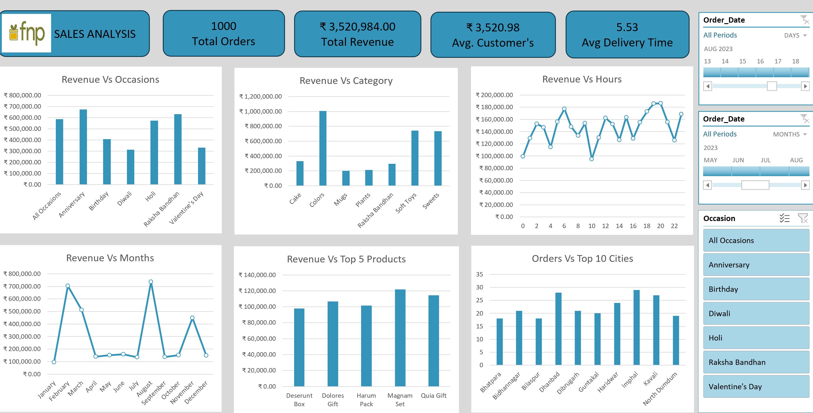

# 📊 Excel Sales Analysis Dashboard

## 📌 Project Overview

This project analyzes the sales data of **Ferns and Petals (FNP)** using Microsoft Excel. The objective is to uncover business insights related to sales performance, customer behavior, product popularity, and delivery trends through an interactive dashboard.

---

## 🎯 Business Objectives

The dashboard answers the following business questions:

- Calculate the total revenue.
- Analyze average order and delivery time.
- Track monthly sales performance.
- Identify the top revenue-generating products.
- Analyze average customer spending.
- Evaluate sales performance of the top 5 products.
- Identify the top 10 cities by number of orders.
- Analyze the relationship between order quantity and delivery time.
- Compare revenue across different occasions.
- Identify the most popular products for each occasion.

---

## 🛠️ Tools Used

- Microsoft Excel
- Power Query
- Pivot Tables
- Pivot Charts
- Slicers
- Timeline

---

## 📊 Dashboard Features

- Revenue KPIs
- Customer Spending Analysis
- Monthly Sales Trend
- Revenue by Occasion
- Revenue by Category
- Revenue by Hour
- Top Products by Revenue
- Top 10 Cities by Orders
- Interactive Filters

---

## 📷 Dashboard Preview

---

## 📂 Dataset

The dataset contains information about orders, products, customers, occasions, revenue, cities, and delivery details for FNP sales.

---

## 📈 Skills Demonstrated

- Data Cleaning (Power Query)
- Data Transformation (ETL)
- Pivot Table Analysis
- Dashboard Design
- Business Analysis
- Data Visualization

  ## 📄 Project Files

- Excel Sales Analysis Dashboard.xlsx
- Customers.csv
- Orders.csv
- Products.csv
- Problem_Statement.pdf

## 👩‍💻 Author

**Sanjana Sangyam**

---

## Acknowledgement

This project was completed as part of my learning journey in Data Analytics. I followed a guided tutorial by **WSCube Tech** to learn Excel dashboard creation and implemented the project while practicing Power Query, Pivot Tables, Pivot Charts, and dashboard design.

Tutorial Reference:
[https://www.youtube.com/watch?v=YOUR_VIDEO_ID](https://www.youtube.com/watch?v=Wom-eVrE4RY&t=4375s)
